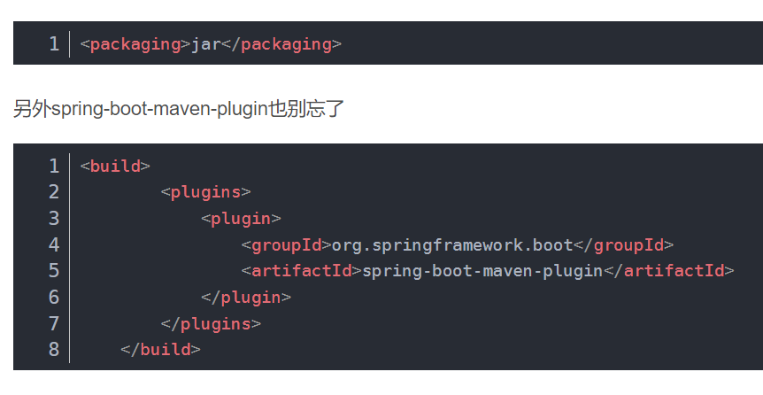
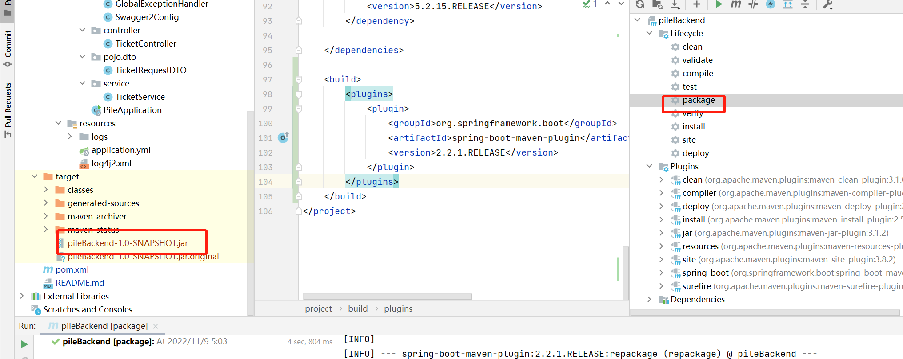
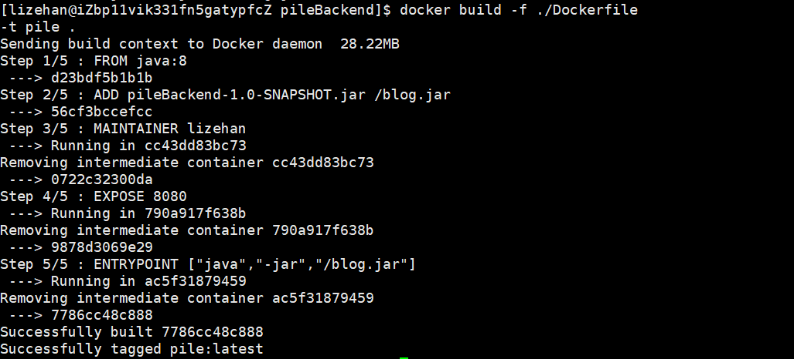
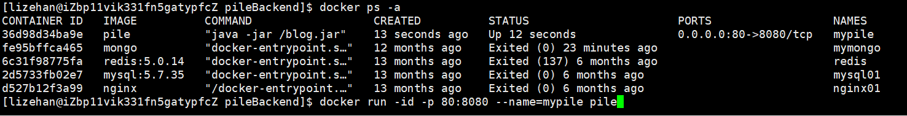
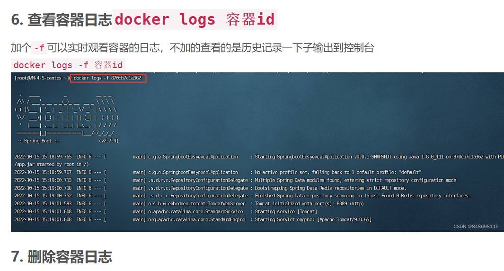

# pileBackend

## 打包部署到docker

### 1. 加入maven配置





### 2. 写 DockerFile

```dockerfile
# 关键字表示，jar包依赖的环境。java:8  相当于jdk1.8
FROM java:8
 
#ADD命令 
#   blog-0.0.1-SNAPSHOT.jar：这是你上传jar包的名称。
#   /blog.jar：这是自定义的名称。但是注意要有之前的/
ADD pileBackend-1.0-SNAPSHOT.jar /blog.jar
 
MAINTAINER lizehan
 
#EXPOSE 项目暴露的端口号
EXPOSE 8080

#/blog.jar此处的名称要和ADD命令后面的一样。
ENTRYPOINT ["java","-jar","/blog.jar"]
```

### 3. build docker镜像

```docker
docker build -f ./Dockerfile -t {image_name} .
```



### 4. 运行docker

```docker
docker run -id -p {port in machine}:{port docker} --name={container_name} {image_name}
```



### 5. 查看日志


